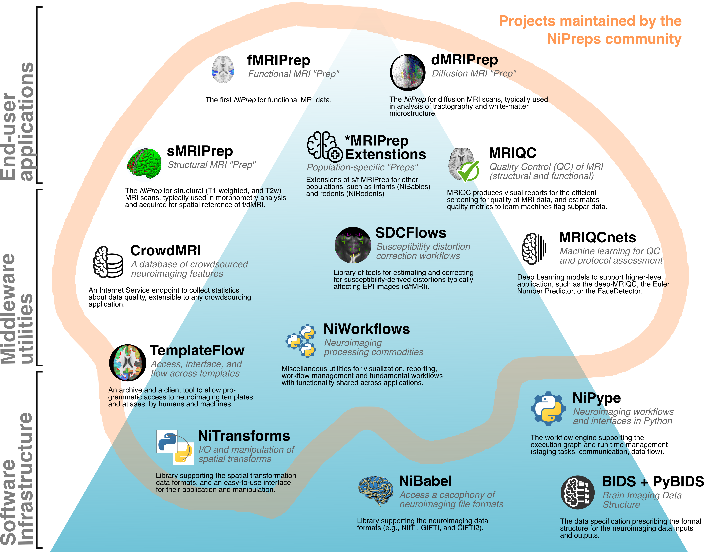
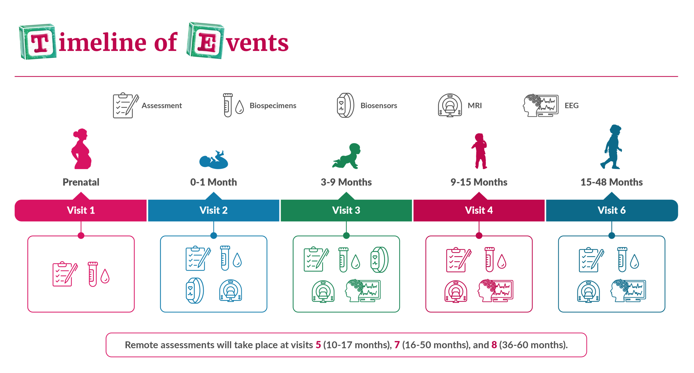
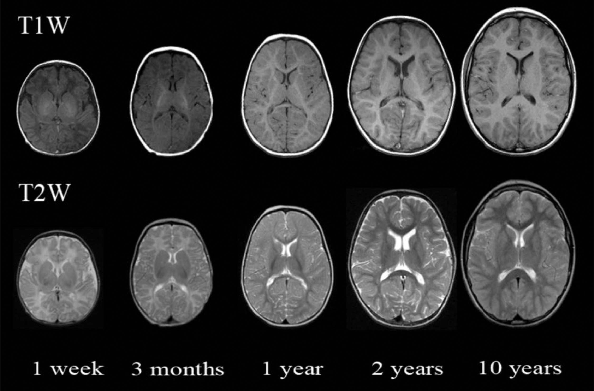
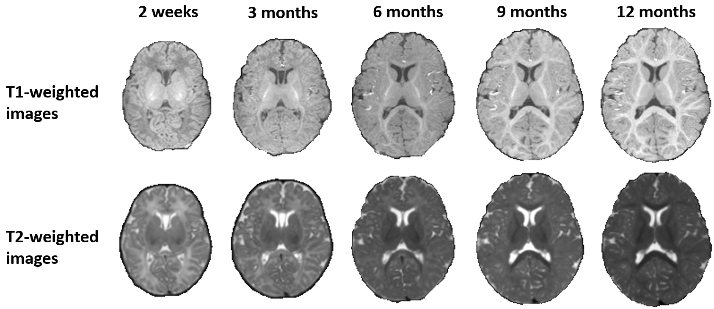

name: title
layout: false
background-image: url("assets/ohbm24-bg.png")
background-size: 100%

.center-div[
<a href="https://mgxd.github.io/OHBM2024">

https://mgxd.github.io/OHBM2024

</a>
]

.center[

## fMRIPrep-Infants: Bringing standardized, easy-to-use, transparent preprocessing to the infant MRI space

### Mathias Goncalves

#### mathiasg@stanford.edu

.small[I have no disclosures]

]

???

Hello, my name is Mathias Goncalves, I'm a software developer at the Poldrack lab,
and today I'll be talking about the journey of fMRIPrep-Infants, which you may know as NiBabies,
and what it can bring to the infant MRI space.

Just want to mention a few things before beginning:

1. I have no disclosures.
2. These slides are available online, so if anyone wants to follow along the QR code and link will bring you to the slides.

---
name: newsection
layout: true

.perma-sidebar[

OHBM24 - fMRIPrep-Infants

]

.perma-footer[

]

---

# Outline

.two-column[

.column[.large[

* Road to fMRIPrep-Infants

* HBCD and Longitudinal Studies

* Workflow Adaptations

]]

]

---

# fMRIPrep, then

- fMRIPrep - a preprocessing pipeline for fMRI

  - Accessible - containerized environment
  - Robust - adaptive workflow based on available data
  - Transparent - open source source code, produces reports for additional information
    - figures for vital preprocessing steps
    - metadata (scans overview, version / commands, errors)

???

minimal requirements -> (BIDS)
analysis-agnostic processing -> BIDS-derivatives, do not lock you into a particular postprocessing stream
a slight tradeoff is implicitly taken - analysis may not be hypertuned for particular parameters, but a standard of processing steps is good for a field with lots of potential for variation.

modern software-engineering standards

---

# NiPreps, now

.center-div[

]

???

This is an illustration of the NiPreps ecosystem: formerly many of these components were integrated directly into fmriprep.

Throughout development, we found splitting these components helped in a few ways:

1. Make testing each component easier.
1. Allow other NiPreps (or any user in the community) to leverage or build off from.

---
background-color: #000000

   

.center-div[
.red[
# So let's just use fMRIPrep on babies.
]]

---

# HEALthy Brain and Child Development

.center-div[

]

???

The Healthy Brain and Child Development project is a longitudinal effort to collect various
types of data through the early stages of development.

Over 7000, multi-site (27 recruitment sites in the USA), and multiple scanner manufacturers (Siemens/GE/Philips).

---

# HBCD study workflow

.center-div[

]

???

This shows a subset of the MRI processing

---

# Differences from adults

.center-div[

.small[([Miller, 2020](https://doi.org/10.1016/j.spen.2020.100796))]
]

???

Here you can see brain developement throughout 10 years, at birth the typical infant brain is 25% the size of an adults.
Additionally, the morphometry varies throughout development as tissue growth is still occuring.

---

# Differences from adults

.center-div[

.small[([MICCAI Segmentation Challenge, 2017](https://iseg2017.web.unc.edu/))]
]

???

Now the change in contrast is more apparent here.
This image is from a MICCAI segmentation challenge.

One of biggest difficulties is the non-uniform myelination, most pronounced
during the 6-9 month range, also known as the isointense period.

This is when gray & white Matter lack clear contrast, making brain segmentation challenging.

---

# fMRIPrep-Infants: Adaptations

## Conceptual Adapations

???

I like to think of adapations in two categories:

* Conceptual adapations -> breaking an expection (ex/implicit) of the existing software
  (potentially altering the )
* Algorithmic adapations -> altering the file and/or algorithms used for a preprocessing step.

---
count: false

# fMRIPrep-Infants: Adaptations

## Conceptual Adapations

#### *Shift to session based processing*

Multi-session studies, each time point should be analysed differently as significant maturation can occur between visits.

--

#### *Allow connection slots for previous computed derivatives*

Previously self contained, but should be a tool where users can manually intervene, or quickly test alternative methods.

---

# Adaptations: Processing Steps

## Brain Extraction

* Modified antsBrainExtraction workflow, using input T2w -> atlas, and then coregistering functionals.

* Two new infant templates, which includes various timepoints (i.e. cohorts) which can be age matched to more similarly align with expected participant

???

UNC infant template (default) - neonate, 1 year old, 2 year old,
MNIInfant - multiple timepoints, though masks leave something to be desired

---

# Adaptations: Processing Steps

## Brain Segmentation

* Addition of Joint Label Fusion ([Wang 2013](https://doi.org/10.3389/fninf.2013.00027)), to increase robustness of tissue, cortical, and subcortical segmentation.

???

FSL FAST unreliable with ambiguous tissue contrast.

Expert labeled images (atlases) using a registration and voting algorithm.

Limitations here:

1. Increased processing time (as many image registrations as atlases)
1. Available age matched atlases.

---

# Adaptations: Processing Steps

.two-column[
.column[

## Brain Segmentation (cont.)

Alternatively, deep learning methods are becoming more desirable:

* Decrease processing time
* Perform comparable or better

]

.small[([Hendrickson, 2023](https://doi.org/10.1101/2023.03.22.533696))]
]

???

Additionally, BIBSNet is a deep learning network for segmenting baby brains, built ontop of nnU-net.

This greatly reduces processing time, while 
---

# Adaptations: Processing Steps

## Surface Reconstruction

- FreeSurfer's recon-all has shown great performance for adults, and even children as young as 24mo+, but struggles in initial stages.

---

# Adapations: Processing Steps

## Subcortical Structure Alignment

- To avoid the size problem (small structures transformed to adult template, treated as a big blob)
first register to similar space (MNIInfant), and then register each subcortical region independently
to MNI152 space, reducing the distortion per structure. (figure??)

---

# Community

Techniques, algorithms, and alternatives may advance, but fostering a community will help much more in the long run.

???

Less time spent focusing on turning knobs, and more time allowing researchers to answer their questions.

---

## Conclusion

* The need for standardization
  * HBCD study

* Adaptations
  * Brain Extraction
  * Surface Reconstruction
  * Subcortical alignment

* Results

???

---
layout: false
count: false
background-image: url(assets/ohbm24-bg.png)
background-size: 100%

.center[

## Thank you

### Mathias Goncalves

mathiasg@stanford.edu

#### *fMRIPrep-Infants: Bringing standardized, easy-to-use, transparent preprocessing to the infant MRI space*

Funding: [RF1MH121867](https://reporter.nih.gov/project-details/10260312), [CZI EOSS5-000266](https://chanzuckerberg.com/eoss/proposals/nipreps-a-community-framework-for-reproducible-neuroimaging/)

]

.collaborators[

## Collaborators

Julia Moser, Thomas Madison, Audrey Houghton, Lucille Moore, Greg Conan, Martin Styner, Dimitrios Alexopoulos, Christopher D. Smyser,Jacob Lundquist, Rae McCollum, Lidia Hadera, Sanju Koirala, Steve Nelson, Kim Weldon, Christopher Markiewicz, Russell A. Poldrack, Eric Feczko, Oscar Esteban, Damien Fair

]
