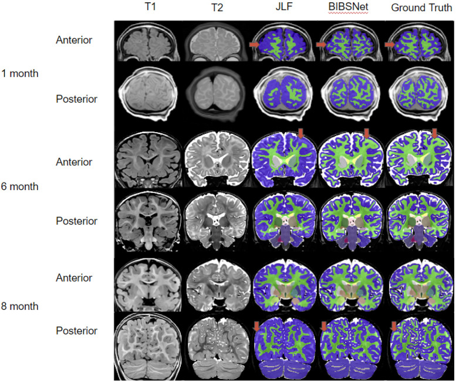

name: title
layout: false
background-image: url("assets/ohbm24-bg.png")
background-size: 100%

.center-div[
<a href="https://mgxd.github.io/ohbm2024">

https://mgxd.github.io/ohbm2024

</a>
]

.center[

## fMRIPrep-Infants: Bringing standardized, easy-to-use, transparent preprocessing to the infant MRI space

### Mathias Goncalves

#### mathiasg@stanford.edu

.small[I have no disclosures]

]

???

Hello, my name is Mathias Goncalves, I'm a software developer at the Poldrack lab,
and today I'll be talking about the journey of fMRIPrep-Infants, which you may know as NiBabies,
and what it can bring to the infant MRI space.

Just want to mention a few things before beginning:

1. I have no disclosures.
2. These slides are available online, so if anyone wants to follow along the QR code and link will bring you to the slides.

---
name: newsection
layout: true

.perma-sidebar[

OHBM24 - fMRIPrep-Infants

]

.perma-footer[

]

---

# Outline

.two-column[

.column[.large[

* Road to fMRIPrep-Infants / NiBabies

* A Growing Need
  * Longitudinal Studies
  * Differences from Adults

* Workflow Adaptations

]]

]

---

# fMRIPrep, circa 2016

### Building a following with a philosophy

--

* **Easy-to-use**

  * *Adheres to a common structure, containerized environment provides reproducibility*

???

structure -> BIDS
container -> BIDS-App
container freezes dependency versioning.

--

* **Robust**

  * *Dynamically adapt workflow based on available data, to handle diverse acquisition protocols and scanner manufacturers*

???

analysis-agnostic processing -> BIDS-derivatives, do not lock you into a particular postprocessing stream

--

* **Transparent**

  * *Visual reports outline performance across various steps*
  * *Code openly available*

???

And from this came a package for preprocessing scanner data.
This was all bundled within a single monolith application.

---

# NiPreps, now

.center-div[

]

???

This is an illustration of the NiPreps ecosystem: formerly many of these components were integrated directly into fmriprep.

Throughout development, we found splitting these components helped in a few ways:

1. Make testing each component easier.
1. Allow other NiPreps (or any user in the community) to leverage or build off from.

---

# Avalanche of Large scale Longitudinal Studies

* Developing Human Connectome Project (2010)

* Adolescent Brain Cognitive Development Study (2017)

* Baby Connectome Project (2016)

* HEALthy Brain and Child Development (2023)

???

Multi-site, multi-session data acquisition is only increasing in popularity.

---

# HEALthy Brain and Child Development

.center-div[

]

???

The Healthy Brain and Child Development project is a longitudinal effort to collect various
types of data through the early stages of development.

Over 7000, multi-site (27 recruitment sites in the USA), and multiple scanner manufacturers (Siemens/GE/Philips).

HBCD - 9am on Wednesday symposium - Grand Ballroom 104-105

Wednesday morning (9am) symposium  Grandballroom 104-105

---

# HBCD study workflow

.center-div[

]

???

This shows a subset of the MRI data flow in the HBCD study.

---
background-color: #000000

   

.center-div[
.red[
# So let's just use fMRIPrep on babies.
]]

---

# Differences from adults

.center-div[

.small[([Miller, 2020](https://doi.org/10.1016/j.spen.2020.100796))]
]

???

Here you can see brain developement throughout 10 years, at birth the typical infant brain is 25% the size of an adults.
Additionally, the morphometry varies throughout development as tissue growth is still occuring.

---

# Differences from adults

.center-div[

.small[([MICCAI Segmentation Challenge, 2017](https://iseg2017.web.unc.edu/))]
]

???

Now the change in contrast is more apparent here.
This image is from a MICCAI segmentation challenge.

One of biggest difficulties is the non-uniform myelination, most pronounced
during the 6-9 month range, also known as the isointense period.

This is when gray & white Matter lack clear contrast, making brain segmentation challenging.

---

# fMRIPrep-Infants: Adaptations

## Conceptual Adapations

???

I like to think of adapations in two categories:

* Conceptual adapations -> breaking an expection (ex/implicit) of the existing software
  (potentially altering the )
* Algorithmic adapations -> altering the file and/or algorithms used for a preprocessing step.

---
count: false

# fMRIPrep-Infants: Adaptations

## Conceptual Adapations

#### *Shift to session based processing*

Multi-session studies, each time point should be analysed differently as significant maturation can occur between visits.

--

#### *Allow connection slots for previous computed derivatives*

Previously self contained, but should be a tool where users can manually intervene, or test alternative methods.

---

# Adaptations: Processing Steps

## Brain Extraction

* Modified `antsBrainExtraction` workflow, using input T2w -> atlas, and then coregistering structurals (if available).

* Infant templates, which includes various timepoints (i.e. cohorts) which can be age matched to the participant.

???

UNC infant template (default) - neonate, 1 year old, 2 year old, (You may hear elements in Fan's presentation)

MNIInfant - multiple timepoints, though masks leave something to be desired

---

# Adaptations: Processing Steps

## Brain Segmentation

* Addition of Joint Label Fusion ([Wang 2013](https://doi.org/10.3389/fninf.2013.00027)), to increase robustness of tissue, cortical, and subcortical segmentation.

* Atlases include pre-labeled segmentations, as well as a T1w or T2w reference.

.center-div[

]

???

FSL FAST unreliable with ambiguous tissue contrast.

Pre-labeled includes manual labelling by an expert, or supervised labelling by an automatic source.

Expert labeled images (atlases) using a registration and voting algorithm.

Limitations here:

1. Ideally you need age-matched and accurately labeled atlases.
1. Registration is an expensive operation, and multiple atlases are recommended to account for individual difference.

There is an effort to aggregate and distribute these atlases

---

# Adaptations: Processing Steps

.two-column[
.column[

## Brain Segmentation (cont.)

Alternatively, deep learning methods are becoming more desirable alternative due to:

* Decrease processing time
* Comparable or improved performance

]

.small[([Hendrickson, 2023](https://doi.org/10.1101/2023.03.22.533696))]
]

???

Additionally, BIBSNet is a deep learning network for segmenting baby brains, built ontop of nnU-net.

This greatly reduces processing time, while 

---

# Adaptations: Processing Steps

## Surface Reconstruction

* FreeSurfer's recon-all has shown great performance for adults, and even children as young as 24mo+, but struggles in early development.

--

* Infant FreeSurfer ([Zollei 2020](https://doi.org/10.1016/j.neuroimage.2020.116946)) provides a similar process, with modifications to handle weaker GM/WM contrast.

???

Good alternative if tissue contrast is reasonable, but is difficult to rely on only single T1w channel.

--

* M-CRIB-S ([Adamson 2020](https://doi.org/10.1038/s41598-020-61326-2)) leverages novel surface atlases, along with a T2w channel, along with dHCP surface reconstruction methods ([Makropoulos 2018](https://doi.org/10.1016/j.neuroimage.2018.01.054))

???

Surface pipeline leveraging the Melbourne Children’s Regional Infant Brain atlases

voxel-based parcellations compatible with the Desikan-Killiany (DK) and the Desikan-Killiany-Tourville (DKT) cortical labelling schemes.

--

### All three options are availabe, and may out-perform each other at various developmental stages

---

# Adapations: Processing Steps

## Subcortical Structure Alignment

* Modification during CIFTI generation, to improve subcortical structure accuracy throughout registrations.

* HCP grayordinates are in fsLR space, which uses the standard adult MNI template for volumetric components.

* Rather than registering the entire brain in one shot from infant to adult:
  * The segmentation is registered and applied to the infant MNI template.
  * Each region is individually registered to the adult MNI template

???

Similar to why we are using alternative infant templates for brain extraction, we want to minimize distortion when transforming an image to a standard space.

---

# Community

Techniques, algorithms, and alternatives may advance, but fostering a community will help much more in the long run.

## GitHub: [https://github.com/nipreps/nibabies](https://github.com/nipreps/nibabies)
  * Code, Error Reporting

## NeuroStars: [https://neurostars.org/](https://neurostars.org/)
  * General / Usage Questions

???

As adoption grows, protocol details, scanner details, collection headaches, will need to considered. Sohye's data later will show you problems devlopers may run into.

Less time spent focusing on turning knobs, and more time allowing researchers to answer their questions.

---

# Conclusion

.two-column[

.column[.large[

* Road to fMRIPrep-Infants / NiBabies

* A Growing Need
  * Longitudinal Studies
  * Differences from Adults

* Workflow Adaptations

]]

]

???

---
layout: false
count: false
background-image: url(assets/ohbm24-bg.png)
background-size: 100%

.center[

## Thank you

### Mathias Goncalves

mathiasg@stanford.edu

#### *fMRIPrep-Infants: Bringing standardized, easy-to-use, transparent preprocessing to the infant MRI space*

Funding: [RF1MH121867](https://reporter.nih.gov/project-details/10260312), [CZI EOSS5-000266](https://chanzuckerberg.com/eoss/proposals/nipreps-a-community-framework-for-reproducible-neuroimaging/)

]

.collaborators[

## Collaborators

Julia Moser, Thomas Madison, Audrey Houghton, Lucille Moore, Greg Conan, Martin Styner, Dimitrios Alexopoulos, Christopher D. Smyser,Jacob Lundquist, Rae McCollum, Lidia Hadera, Sanju Koirala, Steve Nelson, Kim Weldon, Christopher Markiewicz, Russell A. Poldrack, Eric Feczko, Oscar Esteban, Damien Fair

]
